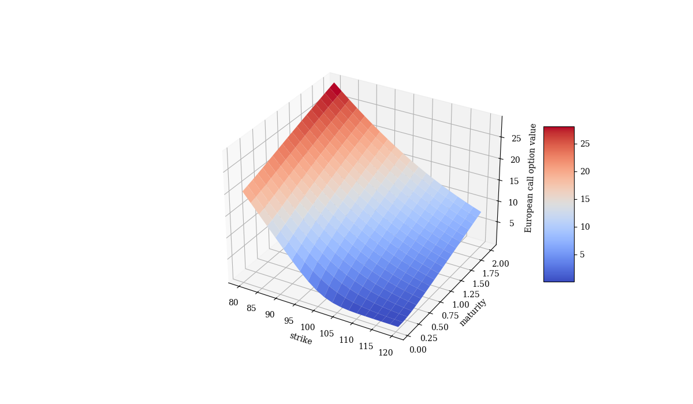
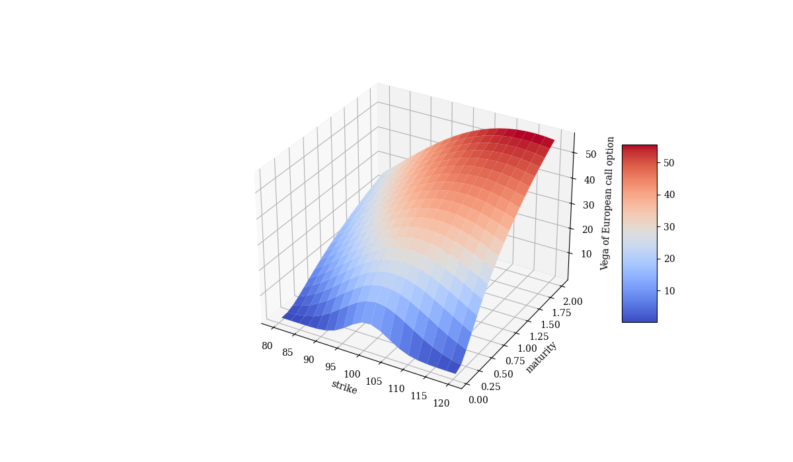

# Pricing-European-Call-Options

### Martin Escobar
LinkedIn: [mescobars](https://www.linkedin.com/in/mescobars/)
Twitter: [@m_escobars](https://twitter.com/m_escobars)

## Description

Implements a class definition to price a European call option with the Black- Scholes-Merton (1973) model as show in [Python for Finance, 2nd ed, Dr. Yves J. Hilpisch](https://home.tpq.io/books/py4fi/)

Description of each file in the repository:

- **pricing_engine.py**: Contains needed class definition.
- **pricing_european_call_option.ipynb**: Contains usage of the class to output statistics and plots

## How does it work?

```python
# what is the value of a european call option given certain parameters?

# parameters
spot_price = 100
strike_price = 105
maturity_years = 1
risk_free_rate = 0.05
volatility = 0.2

# implementation

o = bsm_call_option(spot_price, strike_price, maturity_years, risk_free_rate, volatility)

print(o.value())

```

### A multidimensional point of view

We can think of option values as a function of Strike and Maturity.



Options' vega are also dependant on Strike and Maturity.



